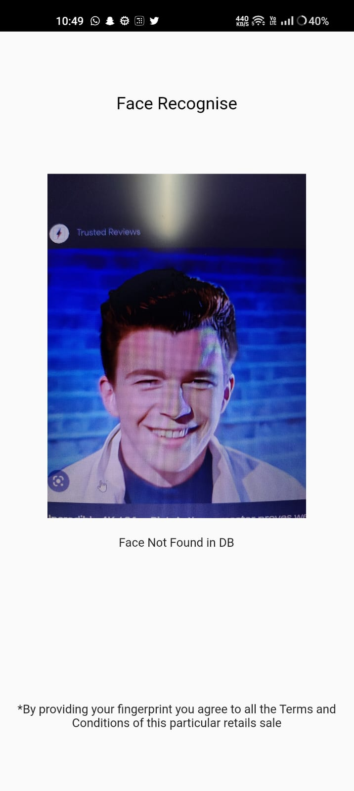
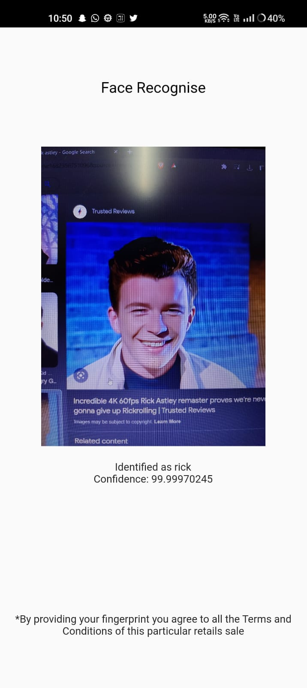
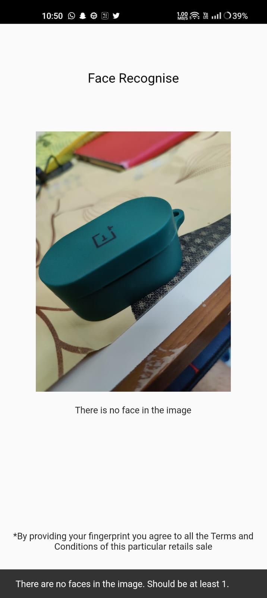

# face_rekog

Recognizing faces just got easier!

### Outputs

<div align=center>




</div>
1 Before adding rick's face to DB <br>
2 After adding rick's face to DB <br>
3 If there are no faces in the image

<br>
<br>

## How to run?
- Run `flutter pub get` in the root folder
- in the root folder, create a `.env` file with the following contents:
```.env
ACCESSKEY=<your_aws_access_key_here>
SECRETKEY=<your_aws_secret_key_here>
```
- run `flutter pub run build_runner build` in root folder, this will generate an `env.g.dart` in the root/env 
- run `flutter run` to run the app.
<br>


# Features to be implemented

- [x] Creating a SignUp Page
- [x] Modifying Login/Signup
- [x] change ui according to device sizes
- [ ] create an onboarding screen
- [ ] testing
- [ ] user should automatically be logged in after registering with a new id
- [ ] Google sign-in

### Features

- [x] Add faces to database
- [x] Scan faces and look into database if the face exists
- [x] Return the name of the face
- [x] If a face is added that is already in the db, then the new face will be stored with the original name.
